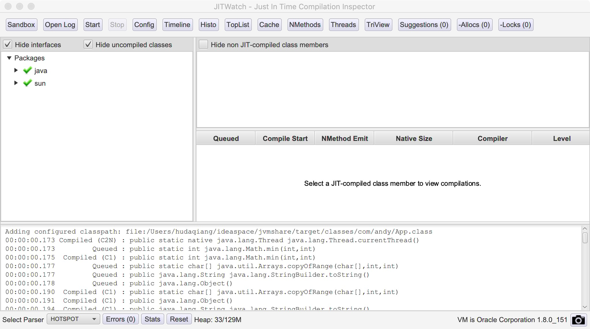

# javac(hotspot)
*源码:* 

```java
public class JavaCompiler {
	public static void main(String[] args) {
		System.out.println("hello world");
	}
}
```

*编译:*
> javac -verbose JavaComiler.java

```
[parsing started RegularFileObject[JavaCompiler.java]]
[parsing completed 26ms]
[search path for source files: .,/Library/Java/JavaVirtualMachines/jdk1.8.0_151.jdk/Contents/Home/lib/dt.jar,/Library/Java/JavaVirtualMachines/jdk1.8.0_151.jdk/Contents/Home/lib/tools.jar]
[search path for class files: /Library/Java/JavaVirtualMachines/jdk1.8.0_151.jdk/Contents/Home/jre/lib/resources.jar,/Library/Java/JavaVirtualMachines/jdk1.8.0_151.jdk/Contents/Home/jre/lib/rt.jar,/Library/Java/JavaVirtualMachines/jdk1.8.0_151.jdk/Contents/Home/jre/lib/sunrsasign.jar,/Library/Java/JavaVirtualMachines/jdk1.8.0_151.jdk/Contents/Home/jre/lib/jsse.jar,/Library/Java/JavaVirtualMachines/jdk1.8.0_151.jdk/Contents/Home/jre/lib/jce.jar,/Library/Java/JavaVirtualMachines/jdk1.8.0_151.jdk/Contents/Home/jre/lib/charsets.jar,/Library/Java/JavaVirtualMachines/jdk1.8.0_151.jdk/Contents/Home/jre/lib/jfr.jar,/Library/Java/JavaVirtualMachines/jdk1.8.0_151.jdk/Contents/Home/jre/classes,/Library/Java/JavaVirtualMachines/jdk1.8.0_151.jdk/Contents/Home/jre/lib/ext/sunec.jar,/Library/Java/JavaVirtualMachines/jdk1.8.0_151.jdk/Contents/Home/jre/lib/ext/nashorn.jar,/Library/Java/JavaVirtualMachines/jdk1.8.0_151.jdk/Contents/Home/jre/lib/ext/cldrdata.jar,/Library/Java/JavaVirtualMachines/jdk1.8.0_151.jdk/Contents/Home/jre/lib/ext/jfxrt.jar,/Library/Java/JavaVirtualMachines/jdk1.8.0_151.jdk/Contents/Home/jre/lib/ext/dnsns.jar,/Library/Java/JavaVirtualMachines/jdk1.8.0_151.jdk/Contents/Home/jre/lib/ext/localedata.jar,/Library/Java/JavaVirtualMachines/jdk1.8.0_151.jdk/Contents/Home/jre/lib/ext/sunjce_provider.jar,/Library/Java/JavaVirtualMachines/jdk1.8.0_151.jdk/Contents/Home/jre/lib/ext/sunpkcs11.jar,/Library/Java/JavaVirtualMachines/jdk1.8.0_151.jdk/Contents/Home/jre/lib/ext/jaccess.jar,/Library/Java/JavaVirtualMachines/jdk1.8.0_151.jdk/Contents/Home/jre/lib/ext/zipfs.jar,/System/Library/Java/Extensions/MRJToolkit.jar,.,/Library/Java/JavaVirtualMachines/jdk1.8.0_151.jdk/Contents/Home/lib/dt.jar,/Library/Java/JavaVirtualMachines/jdk1.8.0_151.jdk/Contents/Home/lib/tools.jar]
[loading ZipFileIndexFileObject[/Library/Java/JavaVirtualMachines/jdk1.8.0_151.jdk/Contents/Home/lib/ct.sym(META-INF/sym/rt.jar/java/lang/Object.class)]]
[loading ZipFileIndexFileObject[/Library/Java/JavaVirtualMachines/jdk1.8.0_151.jdk/Contents/Home/lib/ct.sym(META-INF/sym/rt.jar/java/lang/String.class)]]
[checking JavaCompiler]
[loading ZipFileIndexFileObject[/Library/Java/JavaVirtualMachines/jdk1.8.0_151.jdk/Contents/Home/lib/ct.sym(META-INF/sym/rt.jar/java/io/Serializable.class)]]
[loading ZipFileIndexFileObject[/Library/Java/JavaVirtualMachines/jdk1.8.0_151.jdk/Contents/Home/lib/ct.sym(META-INF/sym/rt.jar/java/lang/AutoCloseable.class)]]
[loading ZipFileIndexFileObject[/Library/Java/JavaVirtualMachines/jdk1.8.0_151.jdk/Contents/Home/lib/ct.sym(META-INF/sym/rt.jar/java/lang/Byte.class)]]
[loading ZipFileIndexFileObject[/Library/Java/JavaVirtualMachines/jdk1.8.0_151.jdk/Contents/Home/lib/ct.sym(META-INF/sym/rt.jar/java/lang/Character.class)]]
[loading ZipFileIndexFileObject[/Library/Java/JavaVirtualMachines/jdk1.8.0_151.jdk/Contents/Home/lib/ct.sym(META-INF/sym/rt.jar/java/lang/Short.class)]]
[loading ZipFileIndexFileObject[/Library/Java/JavaVirtualMachines/jdk1.8.0_151.jdk/Contents/Home/lib/ct.sym(META-INF/sym/rt.jar/java/lang/Long.class)]]
[loading ZipFileIndexFileObject[/Library/Java/JavaVirtualMachines/jdk1.8.0_151.jdk/Contents/Home/lib/ct.sym(META-INF/sym/rt.jar/java/lang/Float.class)]]
[loading ZipFileIndexFileObject[/Library/Java/JavaVirtualMachines/jdk1.8.0_151.jdk/Contents/Home/lib/ct.sym(META-INF/sym/rt.jar/java/lang/Integer.class)]]
[loading ZipFileIndexFileObject[/Library/Java/JavaVirtualMachines/jdk1.8.0_151.jdk/Contents/Home/lib/ct.sym(META-INF/sym/rt.jar/java/lang/Double.class)]]
[loading ZipFileIndexFileObject[/Library/Java/JavaVirtualMachines/jdk1.8.0_151.jdk/Contents/Home/lib/ct.sym(META-INF/sym/rt.jar/java/lang/Boolean.class)]]
[loading ZipFileIndexFileObject[/Library/Java/JavaVirtualMachines/jdk1.8.0_151.jdk/Contents/Home/lib/ct.sym(META-INF/sym/rt.jar/java/lang/Void.class)]]
[loading ZipFileIndexFileObject[/Library/Java/JavaVirtualMachines/jdk1.8.0_151.jdk/Contents/Home/lib/ct.sym(META-INF/sym/rt.jar/java/lang/System.class)]]
[loading ZipFileIndexFileObject[/Library/Java/JavaVirtualMachines/jdk1.8.0_151.jdk/Contents/Home/lib/ct.sym(META-INF/sym/rt.jar/java/io/PrintStream.class)]]
[loading ZipFileIndexFileObject[/Library/Java/JavaVirtualMachines/jdk1.8.0_151.jdk/Contents/Home/lib/ct.sym(META-INF/sym/rt.jar/java/lang/Appendable.class)]]
[loading ZipFileIndexFileObject[/Library/Java/JavaVirtualMachines/jdk1.8.0_151.jdk/Contents/Home/lib/ct.sym(META-INF/sym/rt.jar/java/io/Closeable.class)]]
[loading ZipFileIndexFileObject[/Library/Java/JavaVirtualMachines/jdk1.8.0_151.jdk/Contents/Home/lib/ct.sym(META-INF/sym/rt.jar/java/io/FilterOutputStream.class)]]
[loading ZipFileIndexFileObject[/Library/Java/JavaVirtualMachines/jdk1.8.0_151.jdk/Contents/Home/lib/ct.sym(META-INF/sym/rt.jar/java/io/OutputStream.class)]]
[loading ZipFileIndexFileObject[/Library/Java/JavaVirtualMachines/jdk1.8.0_151.jdk/Contents/Home/lib/ct.sym(META-INF/sym/rt.jar/java/io/Flushable.class)]]
[loading ZipFileIndexFileObject[/Library/Java/JavaVirtualMachines/jdk1.8.0_151.jdk/Contents/Home/lib/ct.sym(META-INF/sym/rt.jar/java/lang/Comparable.class)]]
[loading ZipFileIndexFileObject[/Library/Java/JavaVirtualMachines/jdk1.8.0_151.jdk/Contents/Home/lib/ct.sym(META-INF/sym/rt.jar/java/lang/CharSequence.class)]]
[wrote RegularFileObject[JavaCompiler.class]]
[total 352ms]
```

总结:

- 语法分析 

- 查找源码

- 检查源码 

- 加载ZipFileIndexFileObject

- 写入字节码文件对象


jit编译器

> JITWatch 是一个Java HotSpot JIT编译器的日志分析器， 它读取JIT日志文件并虚拟图形化显示其活动。

- 安装
	
	```
	git clone git@github.com:AdoptOpenJDK/jitwatch.git
   cd jitwatch
   mvn clean install -DskipTests=true
   ./launchUI.sh 
	```
	
- 使用

	1. 使用-XX:+UnlockDiagnosticVMOptions -XX:+PrintAssembly -XX:+LogCompilation -XX:LogFile=jit.log  参数启动应用程序，然后工作目录下就会产生一个名为jit.log的文件。
   2. 运行jitwatch，点击"Open Log"按钮，加载jit.log文件
   3. 点击"Config"按钮，设置应用的源码路径和编译后的Class路径，如下图所示：
   
   
   
查看字节码信息
> javap -c JavaCompiler

```
Compiled from "JavaCompiler.java"
public class JavaCompiler {
  public JavaCompiler();
    Code:
       0: aload_0
       1: invokespecial #1                  // Method java/lang/Object."<init>":()V
       4: return

  public static void main(java.lang.String[]);
    Code:
       0: getstatic     #2                  // Field java/lang/System.out:Ljava/io/PrintStream;
       3: ldc           #3                  // String hello world
       5: invokevirtual #4                  // Method java/io/PrintStream.println:(Ljava/lang/String;)V
       8: return
}
```