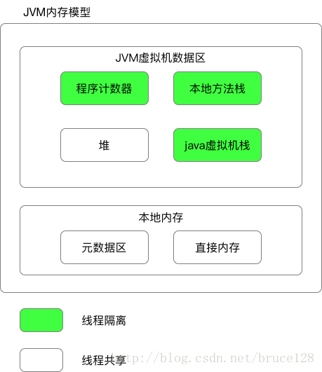
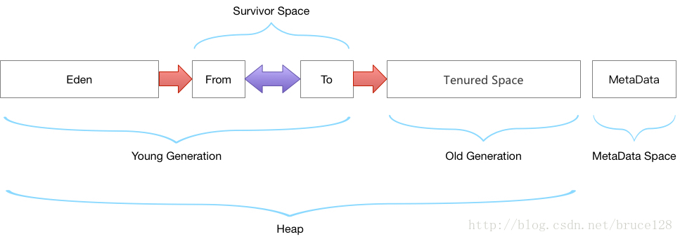

# jvm

*OOM:*

*方法区:*

> jdk version < 1.8  永久代 jvm堆内存

	1. -XX:PermSize(方法区初始大小)
	2. -XX:MaxPermSize(方法区最大大小,java.lang.OutOfMemoryError: PermGen)

>jdk version >= 1.8	元数据区 本地内存

	1. -XX: MetaspaceSize(元空间初始大小)
	2. -XX: MaxMetaspaceSize(元空间最大大小,java.lang.OutOfMemoryError: Metadata space)

  

1. 程序计数器:

	- 线程正在执行的字节码代码的行号
	- 线程隔离
	- 线程执行native方法时值为null

2. 元空间(metaspace):(1.8以后方法区的实现)
	- 放虚拟机加载的类信息(版本,字段，方法，接口)
	- 静态变量
	- 常量
	- 常量池:编译期生成的各种字面常量和符号引用

3. 堆(存放对象信息)

	

4. 虚拟机栈(方法执行的内存模型)

	
	
	- 局部变量；
	- 对象的引用；
	- 操作数栈；
	- 动态链接；
	- 方法出口；
	
5. 本地方法栈(虚拟机使用native方法)
6. jvm client模式和server模式

- -client模式时，使用的是C1轻量级编译器，-server模式使用C2重量级编译器；
- C2比C1编译器编译的相对彻底，服务启动起来后，性能更高，垃圾回收优化更好，但是更吃内存；
- 修改jvm启动模式：

>64位系统默认在 JAVA_HOME/jre/lib/amd64/jvm.cfg

>32在目录JAVA_HOME/jre/lib/i386/jvm.cfg

>-server KNOWN

>-client IGNORE