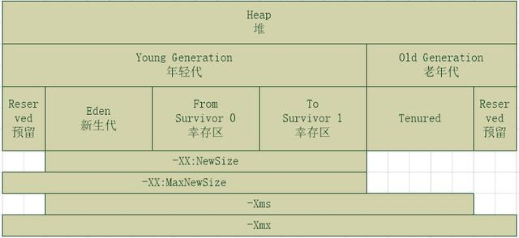

# heap
> 用来存放对象实例的，几乎所有对象实例都会在这里分配内存。Class对象在方法区中分配内存。堆是Java垃圾收集器管理的主要区域（GC堆），垃圾收集器实现了对象的自动销毁。Java堆可以细分为：新生代和老年代；再细致一点的有Eden空间，From Survivor空间，To Survivor空间等。Java堆可以处于物理上不连续的内存空间中，只要逻辑上是连续的即可，就像我们的磁盘空间一样。可以通过-Xmx和-Xms控制。



*配置参数：*

- -XX:NewSize:年轻代除了预留区之外的大小；
- -XX:MaxNewSize:年轻代的最大空间大小；
- -Xms:堆中除了预留空间之外的大小；
- -Xmx:堆的空间大小；
- -XX:SurvivorRatio:Eden和其中一个survivor的比值；
- -XX:NewRatio=3 新生代/老年代的比例；
- -XX:MaxTenuringThreshold(15):新生代对象晋升到老年代的年龄最大阈值，当survivor区的对象的年龄达到TenuringThreshold时，对象进入老年代;
- -XX:TargetSurvivorRatio:设定survivor区的目标使用率。默认50%;
- -XX:+PrintTenuringDistribution:survivor区中对象的年龄分布；
 

1. 新生代(存放新生对象,MinorGC,复制收集算法)：
	
> MinorGC时,Eden和From Survivor区域中存活的对象复制到To Survivor(对象年龄达到老年代标准的直接进入老年代,如果To Survivor空间不够就放到老年代)，同时把这些对象的年龄+1，接着清空Eden和From Survivor中被复制的对象，最后From Survivor和To Survivor互换为下一次的MinorGC做准备。


- Eden:存放新生对象，大对象会直接进入老年代
- From Survivor：保留了一次MinorGC过程中的幸存者
- To Survivor：上一次GC的幸存者，作为这一次GC的被扫描者

2.老年代(GC年龄大的对象,MajorGC/FullGC,标记-清除收集算法):

- 老年代对象比较稳定，MajorGC执行频率低;
- 进行MajorGC前一般会先进行一次MinorGC;
- MajorGC耗时长，会产生内存碎片；

3.TenuringThreshold计算细节：

```cpp
/*
 * Copyright (c) 1997, 2014, Oracle and/or its affiliates. All rights reserved.
 * DO NOT ALTER OR REMOVE COPYRIGHT NOTICES OR THIS FILE HEADER.
 *
 * This code is free software; you can redistribute it and/or modify it
 * under the terms of the GNU General Public License version 2 only, as
 * published by the Free Software Foundation.
 *
 * This code is distributed in the hope that it will be useful, but WITHOUT
 * ANY WARRANTY; without even the implied warranty of MERCHANTABILITY or
 * FITNESS FOR A PARTICULAR PURPOSE.  See the GNU General Public License
 * version 2 for more details (a copy is included in the LICENSE file that
 * accompanied this code).
 *
 * You should have received a copy of the GNU General Public License version
 * 2 along with this work; if not, write to the Free Software Foundation,
 * Inc., 51 Franklin St, Fifth Floor, Boston, MA 02110-1301 USA.
 *
 * Please contact Oracle, 500 Oracle Parkway, Redwood Shores, CA 94065 USA
 * or visit www.oracle.com if you need additional information or have any
 * questions.
 *
 */

#include "precompiled.hpp"
#include "gc_implementation/shared/ageTable.hpp"
#include "gc_implementation/shared/gcPolicyCounters.hpp"
#include "memory/collectorPolicy.hpp"
#include "memory/resourceArea.hpp"
#include "memory/sharedHeap.hpp"
#include "utilities/copy.hpp"

/* Copyright (c) 1992-2009 Oracle and/or its affiliates, and Stanford University.
   See the LICENSE file for license information. */

ageTable::ageTable(bool global) {

  clear();

  if (UsePerfData && global) {

    ResourceMark rm;
    EXCEPTION_MARK;

    const char* agetable_ns = "generation.0.agetable";
    const char* bytes_ns = PerfDataManager::name_space(agetable_ns, "bytes");

    for(int age = 0; age < table_size; age ++) {
      char age_name[10];
      jio_snprintf(age_name, sizeof(age_name), "%2.2d", age);
      const char* cname = PerfDataManager::counter_name(bytes_ns, age_name);
      _perf_sizes[age] = PerfDataManager::create_variable(SUN_GC, cname,
                                                          PerfData::U_Bytes,
                                                          CHECK);
    }

    const char* cname = PerfDataManager::counter_name(agetable_ns, "size");
    PerfDataManager::create_constant(SUN_GC, cname, PerfData::U_None,
                                     table_size, CHECK);
  }
}

void ageTable::clear() {
  for (size_t* p = sizes; p < sizes + table_size; ++p) {
    *p = 0;
  }
}

void ageTable::merge(ageTable* subTable) {
  for (int i = 0; i < table_size; i++) {
    sizes[i]+= subTable->sizes[i];
  }
}

void ageTable::merge_par(ageTable* subTable) {
  for (int i = 0; i < table_size; i++) {
    Atomic::add_ptr(subTable->sizes[i], &sizes[i]);
  }
}

uint ageTable::compute_tenuring_threshold(size_t survivor_capacity) {
  //TargetSurvivorRatio默认50，在MinorGC之后将survivor区的占用率达到这个比例
  size_t desired_survivor_size = (size_t)((((double) survivor_capacity)*TargetSurvivorRatio)/100);
  size_t total = 0;
  uint age = 1;
  assert(sizes[0] == 0, "no objects with age zero should be recorded");
  while (age < table_size) {//table_size=16
    total += sizes[age];
    // check if including objects of age 'age' made us pass the desired
    // size, if so 'age' is the new threshold
    //如果加上这个年龄的所有对象的大小之后，占用量>期望的大小，就设置age为新的晋升阈值
    if (total > desired_survivor_size) break;
    age++;
  }

  uint result = age < MaxTenuringThreshold ? age : MaxTenuringThreshold;

  if (PrintTenuringDistribution || UsePerfData) {

    //打印期望的survivor的大小以及新计算出来的阈值，和设置的最大阈值
    if (PrintTenuringDistribution) {
      gclog_or_tty->cr();
      gclog_or_tty->print_cr("Desired survivor size " SIZE_FORMAT " bytes, new threshold %u (max %u)",
        desired_survivor_size*oopSize, result, (int) MaxTenuringThreshold);
    }

    total = 0;
    age = 1;
    while (age < table_size) {
      total += sizes[age];
      if (sizes[age] > 0) {
        if (PrintTenuringDistribution) {//打印各个年龄所占的空间
          gclog_or_tty->print_cr("- age %3u: " SIZE_FORMAT_W(10) " bytes, " SIZE_FORMAT_W(10) " total",
                                        age,    sizes[age]*oopSize,          total*oopSize);
        }
      }
      if (UsePerfData) {
        _perf_sizes[age]->set_value(sizes[age]*oopSize);
      }
      age++;
    }
    if (UsePerfData) {
      SharedHeap* sh = SharedHeap::heap();
      CollectorPolicy* policy = sh->collector_policy();
      GCPolicyCounters* gc_counters = policy->counters();
      gc_counters->tenuring_threshold()->set_value(result);
      gc_counters->desired_survivor_size()->set_value(
        desired_survivor_size*oopSize);
    }
  }

  return result;//最终返回计算的阈值
}

```


