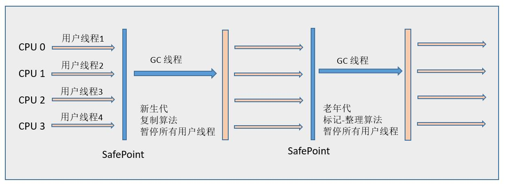
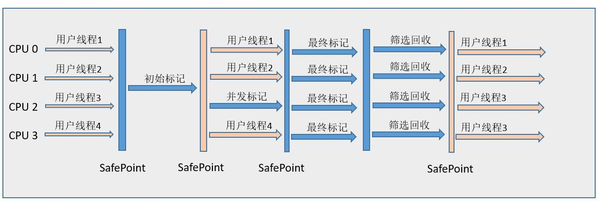

# GC(hotspot)

>回收不是GC roots且没有被GC roots引用的对象。
> GC roots:

- Class - 由系统类加载器(system class loader)加载的对象，这些类是不能够被回收的，他们可以以静态字段的方式保存持有其它对象。我们需要注意的一点就是，通过用户自定义的类加载器加载的类，除非相应的java.lang.Class实例以其它的某种（或多种）方式成为roots，否则它们并不是roots;
- Thread - 活着的线程
- Stack Local - Java方法的local变量或参数
- JNI Local - JNI方法的local变量或参数
- JNI Global - 全局JNI引用
- Monitor Used - 用于同步的监控对象
- Held by JVM - 用于JVM特殊目的由GC保留的对象，但实际上这个与JVM的实现是有关的。可能已知的一些类型是：系统类加载器、一些JVM知道的重要的异常类、一些用于处理异常的预分配对象以及一些自定义的类加载器等。然而，JVM并没有为这些对象提供其它的信息，因此需要去确定哪些是属于"JVM持有"的了。

1.GC分类：

- 新生代GC包括：串行GC(Serial)、并行GC(ParNew)、并行回收GC(ParallelScavenge)

- 老年代GC包括：串行GC(Serial Old)、并行GC(Parallel Old)、并发GC(CMS)

- G1同时支持新生代和老年代

2.默认

- jdk1.7 Parallel Scavenge（新生代）+ Serial Old（老年代）
- jdk1.8 Parallel Scavenge（新生代）+ Parallel Old（老年代）
- jdk1.9 默认垃圾收集器G1
- jdk10 默认垃圾收集器G1

-XX:+PrintCommandLineFlags参数可查看默认设置收集器类型
>-XX:-BytecodeVerificationLocal -XX:-BytecodeVerificationRemote -XX:InitialHeapSize=134217728 -XX:+ManagementServer -XX:MaxHeapSize=2147483648 -XX:+PrintCommandLineFlags -XX:TieredStopAtLevel=1 -XX:+UseCompressedClassPointers -XX:+UseCompressedOops -XX:+UseParallelGC 

-XX:+PrintGCDetails打印的GC日志的新生代、老年代名称
>[Full GC (Metadata GC Threshold) [PSYoungGen: 5103K->0K(71680K)] [ParOldGen: 5926K->7957K(48640K)] 11030K->7957K(120320K), [Metaspace: 20748K->20747K(1067008K)], 0.0498490 secs] [Times: user=0.09 sys=0.00, real=0.05 secs] 

3.Serial收集器

优点：简单高效，没有线程上下文切换开销

缺点：单线程，GC时需要暂定用户线程

4.ParNew收集器

5.Parallel Scavenge收集器(年轻代，复制收集算法，并行，吞吐量)：
>
>吞吐量=运行用户代码时间 / (运行用户代码时间 + 垃圾收集时间）,设置吞吐量的参数：
>
>1.XX:MaxGCPauseMillis 控制最大的垃圾收集停顿时间
>
>2.XX:GCRatio 直接设置吞吐量的大小
>
>3.-XX:+UseAdaptiveSizePocily动态调整停顿时间或者最大吞吐量。

6.Serial Old收集器(老年代,标记-整理算法,单线程)

7.Parallel Old收集器(年老代,标记清除，吞吐)

8.CMS(Concurrent Mark Sweep)收集器(年老代，标记清除，停顿时间短)流程：

- 初始标记
- 并发标记
- 重新标记
- 并发清除

(初始标记和重新标记需要暂定用户线程,有内存碎片,通过控制参数-XX:+UseCMSCompactAtFullCollection，用于在CMS垃圾收集器顶不住要进行FullGC的时候开启空间碎片的合并整理过程)

9.G1(Garbage-First)收集器

优点：

- 并发，并行
- 分代收集
- 空间整合(整体上属于标记-整理算法，不会导致内存碎片)
- 可预测的停顿
- G1收集器将Java堆划分为多个大小相等的Region（独立区域），新生代与老年代都是一部分Region的集合，G1的收集范围则是这一个个Region（化整为零）

工作流程：

- 初始标记(Initial Marking)
- 并发标记(Concurrent Marking)
- 最终标记(Final Marking)
- 筛选回收(Live Data Counting and Evacuation)

10.GC常用参数：
