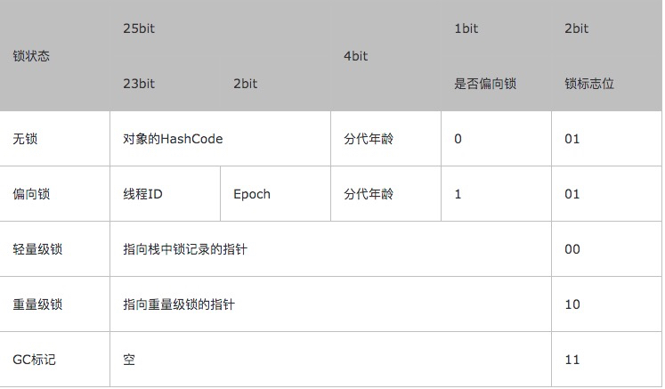
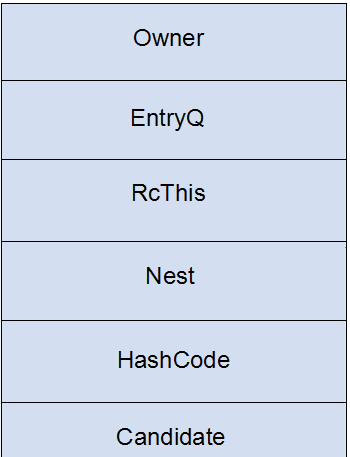
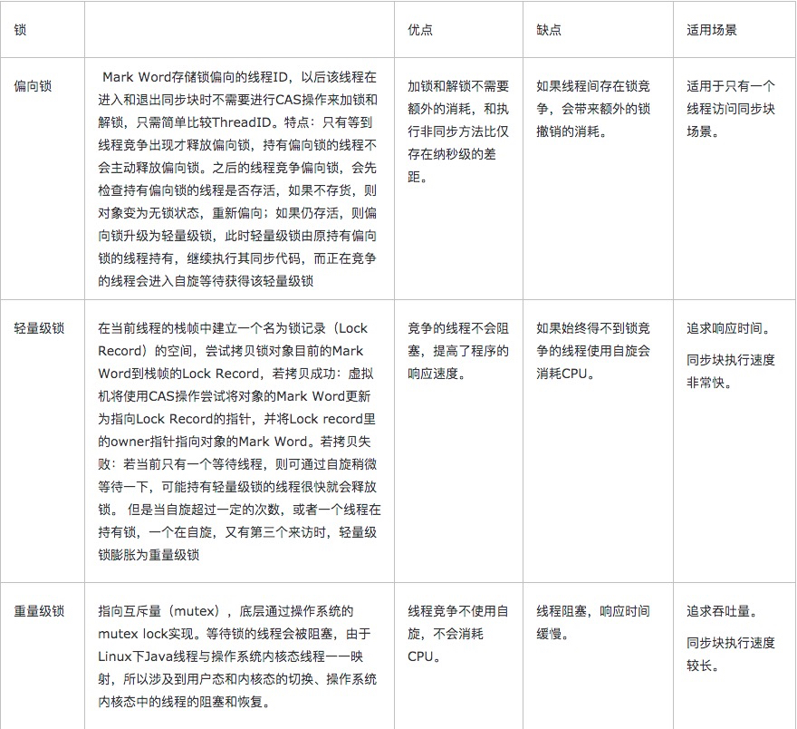

# markword和synchronized
1.markword(32位):


src/hotspot/share/oops/markOop.hpp

```hpp
//  32 bits:
//  --------
//             hash:25 ------------>| age:4    biased_lock:1 lock:2 (normal object)
//             JavaThread*:23 epoch:2 age:4    biased_lock:1 lock:2 (biased object)
//             size:32 ------------------------------------------>| (CMS free block)
//             PromotedObject*:29 ---------->| promo_bits:3 ----->| (CMS promoted object)
//
//  64 bits:
//  --------
//  unused:25 hash:31 -->| unused:1   age:4    biased_lock:1 lock:2 (normal object)
//  JavaThread*:54 epoch:2 unused:1   age:4    biased_lock:1 lock:2 (biased object)
//  PromotedObject*:61 --------------------->| promo_bits:3 ----->| (CMS promoted object)
//  size:64 ----------------------------------------------------->| (CMS free block)
//
//  unused:25 hash:31 -->| cms_free:1 age:4    biased_lock:1 lock:2 (COOPs && normal object)
//  JavaThread*:54 epoch:2 cms_free:1 age:4    biased_lock:1 lock:2 (COOPs && biased object)
//  narrowOop:32 unused:24 cms_free:1 unused:4 promo_bits:3 ----->| (COOPs && CMS promoted object)
//  unused:21 size:35 -->| cms_free:1 unused:7 ------------------>| (COOPs && CMS free block)
//
//  - hash contains the identity hash value: largest value is
//    31 bits, see os::random().  Also, 64-bit vm's require
//    a hash value no bigger than 32 bits because they will not
//    properly generate a mask larger than that: see library_call.cpp
//    and c1_CodePatterns_sparc.cpp.
//
//  - the biased lock pattern is used to bias a lock toward a given
//    thread. When this pattern is set in the low three bits, the lock
//    is either biased toward a given thread or "anonymously" biased,
//    indicating that it is possible for it to be biased. When the
//    lock is biased toward a given thread, locking and unlocking can
//    be performed by that thread without using atomic operations.
//    When a lock's bias is revoked, it reverts back to the normal
//    locking scheme described below.
//
//    Note that we are overloading the meaning of the "unlocked" state
//    of the header. Because we steal a bit from the age we can
//    guarantee that the bias pattern will never be seen for a truly
//    unlocked object.
//
//    Note also that the biased state contains the age bits normally
//    contained in the object header. Large increases in scavenge
//    times were seen when these bits were absent and an arbitrary age
//    assigned to all biased objects, because they tended to consume a
//    significant fraction of the eden semispaces and were not
//    promoted promptly, causing an increase in the amount of copying
//    performed. The runtime system aligns all JavaThread* pointers to
//    a very large value (currently 128 bytes (32bVM) or 256 bytes (64bVM))
//    to make room for the age bits & the epoch bits (used in support of
//    biased locking), and for the CMS "freeness" bit in the 64bVM (+COOPs).
//
//    [JavaThread* | epoch | age | 1 | 01]       lock is biased toward given thread
//    [0           | epoch | age | 1 | 01]       lock is anonymously biased
//
//  - the two lock bits are used to describe three states: locked/unlocked and monitor.
//
//    [ptr             | 00]  locked             ptr points to real header on stack
//    [header      | 0 | 01]  unlocked           regular object header
//    [ptr             | 10]  monitor            inflated lock (header is wapped out)
//    [ptr             | 11]  marked             used by markSweep to mark an object
//                                               not valid at any other time
//
//    We assume that stack/thread pointers have the lowest two bits cleared.
```

>1.Monitor是在jvm底层实现的，底层代码是c++
>
>2.Monitor的enter方法：获取锁
>
>3.Monitor的exit方法：释放锁
>
>4.Monitor的wait方法：为java的Object的wait方法提供支持
>
>5.Monitor的notify方法：为java的Object的notify方法提供支持
>
>6.Monitor的notifyAll方法：为java的Object的notifyAll方法提供支持

- 当没有被当成锁时，这就是一个普通的对象，Mark Word记录对象的HashCode，锁标志位是01，是否偏向锁那一位是0。

- 当对象被当做同步锁并有一个线程A抢到了锁时，锁标志位还是01，但是否偏向锁那一位改成1，前23bit记录抢到锁的线程id，表示进入偏向锁状态。

- 当线程A再次试图来获得锁时，JVM发现同步锁对象的标志位是01，是否偏向锁是1，也就是偏向状态，Mark Word中记录的线程id就是线程A自己的id，表示线程A已经获得了这个偏向锁，可以执行同步锁的代码。

- 当线程B试图获得这个锁时，JVM发现同步锁处于偏向状态，但是Mark Word中的线程id记录的不是B，那么线程B会先用CAS操作试图获得锁，这里的获得锁操作是有可能成功的，因为线程A一般不会自动释放偏向锁。如果抢锁成功，就把Mark Word里的线程id改为线程B的id，代表线程B获得了这个偏向锁，可以执行同步锁代码。如果抢锁失败，则继续执行步骤5。

- 偏向锁状态抢锁失败，代表当前锁有一定的竞争，偏向锁将升级为轻量级锁。JVM会在当前线程的线程栈中开辟一块单独的空间，里面保存指向对象锁Mark Word的指针，同时在对象锁Mark Word中保存指向这片空间的指针。上述两个保存操作都是CAS操作，如果保存成功，代表线程抢到了同步锁，就把Mark Word中的锁标志位改成00，可以执行同步锁代码。如果保存失败，表示抢锁失败，竞争太激烈，继续执行步骤6。

- 轻量级锁抢锁失败，JVM会使用自旋锁，自旋锁不是一个锁状态，只是代表不断的重试，尝试抢锁。从JDK1.7开始，自旋锁默认启用，自旋次数由JVM决定。如果抢锁成功则执行同步锁代码，如果失败则继续执行步骤7。

- 自旋锁重试之后如果抢锁依然失败，同步锁会升级至重量级锁，锁标志位改为10。在这个状态下，未抢到锁的线程都会被阻塞。


2.monitor(依赖操作系统Mutex Lock)

>monitor是线程私有的数据结构，每一个线程都有一个可用monitor record列表，同时还有一个全局的可用列表。每一个被锁住的对象都会和一个monitor关联（对象头的MarkWord中的LockWord指向monitor的起始地址），同时monitor中有一个Owner字段存放拥有该锁的线程的唯一标识，表示该锁被这个线程占用。



- Owner字段：初始时为null,表示当前没有线程拥有该monitor record,当线程拥有该锁后保存线程唯一标识，当锁被释放时又设置为null；
- EntryQ字段：关联一个系统互斥锁(semaphore),阻塞所有试图锁住monitor record失败的线程；
- RcThis字段：表示blocked或waiting在该monitor record上的所有线程的个数
- Nest字段：用来实现重入锁的计数
- HashCode字段：保存从对象头拷贝过来的HashCode值（可能还包含GC age）
- Candidate字段：用来避免不必要的阻塞或等待线程唤醒，因为每一次只有一个线程能够成功拥有锁，如果每次前一个释放锁的线程唤醒所有正在阻塞或等待的线程，会引起不必要的上下文切换（从阻塞到就绪然后因为竞争锁失败又被阻塞）从而导致性能严重下降；Candidate只有两种可能的值0表示没有需要唤醒的线程1表示要唤醒一个继任线程来竞争锁。

3.锁比较




