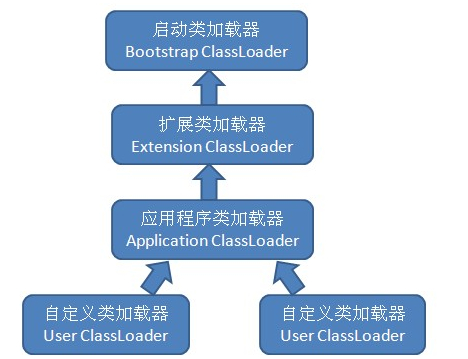

# java类加载机制

*五个阶段*：

>  加载（Loading):

	1.class文件的二进制流；
	2.字节流代表的静态存储结构转化为方法区的运行时数据结构；
	3.在jvm的方法区中生成对应Class对象；
	
	ps:数组的Class对象直接由jvm生成，不是classloader加载的
	
> 验证（Verification）

	1.读入字节流之后需要经过验证字节流是否符合Class文件格式的规范，且能被当前虚拟机执行；
	2.验证和加载时交叉；
	
> 准备(Preparation)

	1.静态变量分配内存
	2.设置初始值
	
> 解析(Resolution)

	虚拟机将常量池内的符号引用替换为直接引用(内存地址偏移量)
	
> 初始化(Initialization)

	执行类构造器<clinit>()方法


>准备、验证、解析3个部分统称为连接（Linking）


*classloader分类：*

- 根加载器Bootstrap Class Loader
- 扩展加载器Extension Class Loader
- 系统应用加载器APP Class Loader
- 用户自定义加载器Customer Class Loader



```java
package com.andy.classloader;

import java.net.URL;
import java.net.URLClassLoader;
import java.util.Arrays;

/**
 * @program: jvmshare
 * @description: 各种类加载器加载的路径
 * @author: Hudaqiang
 * @create: 2019-06-29 12:13
 **/
public class ClassLoaderLoadedPath {
    public static void main(String[] args) {
        //系统类加载器加载的路径
        ClassLoader systemCl = ClassLoader.getSystemClassLoader();
        URLClassLoader systemUrlCl = (URLClassLoader) systemCl;
        URL[] systemUrLs = systemUrlCl.getURLs();
        System.out.println("系统类加载器加载路径:");
        Arrays.asList(systemUrLs).forEach(System.out::println);

        //标准扩展类加载器加载路径
        ClassLoader extCl = systemCl.getParent();
        URLClassLoader extUrlCl = (URLClassLoader) extCl;
        URL[] extUrls = extUrlCl.getURLs();
        System.out.println("标准扩展类加载器加载路径:");
        Arrays.asList(extUrls).forEach(System.out::println);

        //根类加载器加载路径
        ClassLoader bootCl = extCl.getParent();
        //根类加载器由C++实现，java代码中无法引用,ext.getParent会得到null
        System.out.println("根类加载器：" + bootCl);
        System.out.println("根类加载器加载路径:");
        URL[] bootUrls = sun.misc.Launcher.getBootstrapClassPath().getURLs();
        Arrays.asList(bootUrls).forEach(System.out::println);

    }
}


```


*加载过程：双亲委派机制*

- 检查是否已加载

	findLoadedClass(name)
	
- 类加载

	1.初始化为系统类加载器

	2.判断加载器是否存在父类加载器 
	
	3.存在就交给父类加载
	
	4.不存在就直接交给根类加载器
	
	5.根类加载器无法加载的,自己尝试加载

```java
public abstract class ClassLoader {
	//...
	//默认的类加载器为systemClassLoader
	protected ClassLoader() {  
    	SecurityManager security = System.getSecurityManager();  
    	if (security != null) {  
        	security.checkCreateClassLoader();  
    	}  
	    this.parent = getSystemClassLoader();  
	    initialized = true;  
    }    
    
    
	public Class<?> loadClass(String name) throws ClassNotFoundException {
        return loadClass(name, false);
    }

    protected Class<?> loadClass(String name, boolean resolve)
        throws ClassNotFoundException
    {
    	//对需要加载的class上锁
        synchronized (getClassLoadingLock(name)) {
            // First, check if the class has already been loaded
            Class<?> c = findLoadedClass(name);
            if (c == null) {
                long t0 = System.nanoTime();
                try {
                    if (parent != null) {
                    	//如果存在父类加载器，交给父类加载器
                        c = parent.loadClass(name, false);
                    } else {
                        //如果不存在父类(根类无法被java调用)直接调用根类加载器
                        c = findBootstrapClassOrNull(name);
                    }
                } catch (ClassNotFoundException e) {
                    // ClassNotFoundException thrown if class not found
                    // from the non-null parent class loader
                }

                if (c == null) {
                    // If still not found, then invoke findClass in order
                    // to find the class.
                    long t1 = System.nanoTime();
                    c = findClass(name);

                    // this is the defining class loader; record the stats
                    sun.misc.PerfCounter.getParentDelegationTime().addTime(t1 - t0);
                    sun.misc.PerfCounter.getFindClassTime().addElapsedTimeFrom(t1);
                    sun.misc.PerfCounter.getFindClasses().increment();
                }
            }
            if (resolve) {
                resolveClass(c);
            }
            return c;
        }
    }
    
    //...
}

```

*demo:*

```java
package com.andy.classloader;

/**
 * @program: jvmshare
 * @description: 被加载的类
 * @author: Hudaqiang
 * @create: 2019-06-29 11:21
 **/
public class LoadedClass {
    public LoadedClass () {}

    public static void main(String[] args) {
        //查看当前系统类路径中包含的路径条目
        System.out.println(System.getProperty("java.class.path"));
        //调用加载当前类的类加载器（这里即为系统类加载器）加载TestBean
        Class typeLoaded = null;
        try {
            typeLoaded = Class.forName("com.andy.classloader.LoadedClass");
        } catch (ClassNotFoundException e) {
            e.printStackTrace();
        }
        //查看被加载的TestBean类型是被那个类加载器加载的
        System.out.println(typeLoaded != null ? typeLoaded.getClassLoader() : "类加载失败！");
    }
}
```
*结果：*

> sun.misc.Launcher$AppClassLoader@18b4aac2

*自定义类加载器：*

```java
package com.andy.classloader;

import lombok.Data;

import java.io.*;

/**
 * @Description 自定义类加载器
 * @className CustomClassLoader
 * @author hudaqiang
 * @date 2019/6/29 13:08
 */
@Data
public class CustomClassLoader extends ClassLoader {

    @Override
    protected Class<?> findClass(String name) throws ClassNotFoundException {
        byte[] classData = getClassBytes(name);
        if (classData == null) {
            throw new ClassNotFoundException();
        } else {
            return defineClass(name, classData, 0, classData.length);
        }
    }

    /**
     * 获取字节码文件的二进制数据
     * @author hudaqiang
     * @date 2019/6/29 13:01
     */
    private byte[] getClassBytes(String className) {
        String path = getClassPath(className);
        try {
            InputStream ins = new FileInputStream(path);
            ByteArrayOutputStream baos = new ByteArrayOutputStream();
            int bufSize = 2048;
            byte[] byteBuf = new byte[bufSize];
            int bytesNumRead = 0;
            // 读取类文件的字节码
            while ((bytesNumRead = ins.read(byteBuf)) != -1) {
                baos.write(byteBuf, 0, bytesNumRead);
            }
            return baos.toByteArray();
        } catch (IOException e) {
            e.printStackTrace();
        }
        return null;
    }

    /**
     * 根据类名获取字节码文件的路径
     * @author hudaqiang
     * @date 2019/6/29 13:02
     */
    private String getClassPath(String className) {
        return className.replace('.', File.separatorChar) + ".class";
    }

    public static void main(String[] args) throws ClassNotFoundException, IllegalAccessException, InstantiationException {
        CustomClassLoader ccl = new CustomClassLoader();
        String className = "com.andy.classloader.ClassLoaderLoadedPath";
        Object instance = ccl.loadClass(className).newInstance();
        Class<?> customClass = instance.getClass();
        System.out.println(customClass);
        System.out.println(instance instanceof com.andy.classloader.LoadedClass);
    }

}

```

*ps:*

	1.一个类只能被一个类加载器load一次；
	2.同一个类可以被不同的类加载器加载，但是加载出来的class对象equals时为false；


